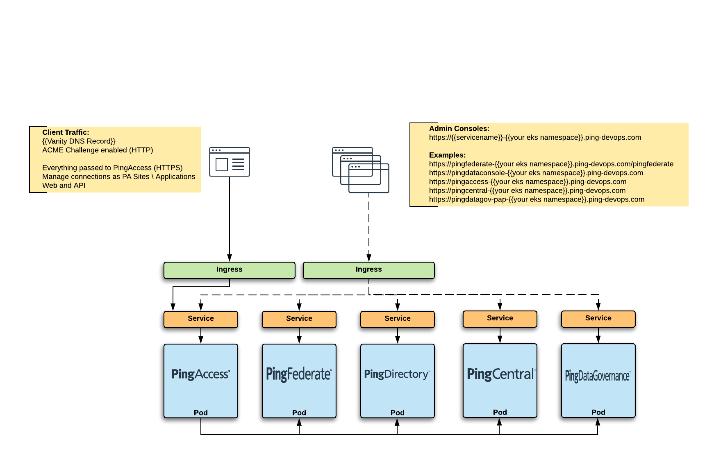

# Convert Compose to K8s
 Using `kompose` to convert a Ping Server Profile `docker-compose.yaml` file

## Pre-requisites
* Access to a Kuberenetes Cluster \ Namespace
* Ping GSA DevOps toolkit -- `brew install ping-devops`
* Create your secret file  
    ```
    ping-devops generate devops-secret > devops-secret-secret.yaml
    ```
    You'll use this file in all your deployments  
    **NOTE:**  Be careful not to upload to GitHub in your Profile(s)

 ## Getting `kompose`
 Go here -- https://kompose.io/

 ## Using `kompose`
I use a set of files in Compose stacks - you'll need the following:
* `docker-compose.yaml`
* `env-vars`
* [Optional] `postman_vars.json` (If you're using `PingConfigurator` with API Collections - [Customer360](https://github.com/pingidentity/Customer360) / [Workforce360](https://github.com/pingidentity/Workforce360))

Put all the files above into a folder and run:  
`kompose convert -f {{folder}}/docker-compose.yaml --volumes configMap`

This should generate a bunch of yamls that describe the Kubernetes `services` and `deployments`

## Post-Convert steps
Unfortunately, `Kompose` makes a deployment assumption about `secrets` that do not match the GTE Cluster implementation.

In each `{{service}}-deployment.yaml` file - remove the `volumes:` references:

```
volumes:
- name: devops-secret
secret:
    items:
    - key: devops-secret
    path: devops-secret
    secretName: devops-secret
```
**and** replace the `volumeMounts:` section
```
volumeMounts:
    - mountPath: /run/secrets/devops-secret
        name: devops-secret
```

with

```
envFrom:
    - secretRef:
        name: devops-secret
```
### Environment Variables
The Kubernetes way of doing env-vars is a little different. The `kompose convert` command will create 2 files that are the equivalents to those in Compose:

| Compose | Kubernetes |
| ----- | ----- |
| `env-vars` | `env-vars-configmap.yaml` |
| `postman_vars.json` | `pingconfig-cm0-configmap.yaml` |

The only changes you should have to make are in these 2 files -- the rest of the k8s yamls should be static.

### PingConfigurator
If you are doing API Injections via the PingConfigurator, you will also need a Kubernetes `Job` file that will execute the collections and then Exit gracefully.

[PingConfigurator - Job File](pingconfig-job.yaml)

The list of API Collections being executed can be seen \ modified on this line (this example shows Customer360 + Delegated Admin - Simple):
```
- env:
    - name: COLLECTIONS
        value: https://www.getpostman.com/collections/344bbc13f4ccd4ebc5f5,https://www.getpostman.com/collections/213af84dea3cbc210516
```

### Ingress Controllers
In order to get access into the Kubernetes services, Ingress Controllers need to be defined.  


A standard Ingress Controller is used to grant access to the Ping Admin consoles:

| Ping Product | Admin Console URL |
| ----- | ----- |
| PingFederate | `https://pingfederate-{{your eks namespace}}.ping-devops.com` |
| PingAccess | `https://pingaccess-{{your eks namespace}}.ping-devops.com` |
| PingCentral | `https://pingcentral-{{your eks namespace}}.ping-devops.com` |
| PingDirectory | `https://pingdataconsole-{{your eks namespace}}.ping-devops.com` |
| PingDataSync | `https://pingdataconsole-{{your eks namespace}}.ping-devops.com` |
| PingDataGov | `https://pingdataconsole-{{your eks namespace}}.ping-devops.com` |
| PingDataGov-PAP | `https://pingdatagov-pap-{{your eks namespace}}.ping-devops.com` |

[Ingress Controller - Ping Admin Consoles](pingadminconsoles-ingress.yaml)

Another Ingress Controller is used to send all **client** traffic to the PingAccess Service:  

[Ingress Controller - Ping Access](pingaccess-ingress.yaml)

## Deployment
* Take the files from `kompose` and the modified `configmap.yaml` files and place them in a folder
* Copy your `devops-secret-secret.yaml` file into the folder
* Copy the 2 Ingress yamls into the folder
* [Optional] Copy the `pingconfig-job.yaml` file into the folder
* Deploy with -- `kubectl apply -f {{folder}}`

To see how the deployment is progressing:

| Command | What it does |
| ----- | ----- | 
| `kubectl get pods` | Gets the list of Pods in the deployment |
| `kubectl logs -f pod/{{pod}}` | Get the logs from a Pod |
| `kubectl logs -f service/{{service}}` | Get the logs from the Service (this is easier) |
| `kubectl logs -f job/pingconfig` | See the API Injection logs |
| `kubectl describe pod/{{pod}}` | Detailed information about the Pod |